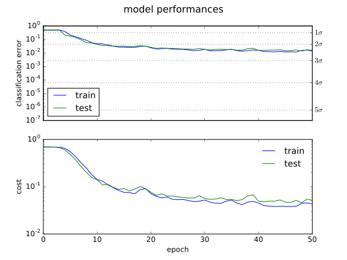

# Search for gravitational-wave transients with a Convolutional Neural Network at the VIRGO interferometer

**Federico Muciaccia**  
30 March 2017  

## Outline

* Why searching for gravitational wave transients?
* How to build the images (peakmaps)
* Real noise
* Gaussian white noise
* What is a Convolutional Neural Network?
* Learning as an optimization problem
* Network architecture
* Memory limitations
* Model training and validation
* k-fold validation
* Class prediction results
* Confusion matrix
* Efficiency and purity
* Efficiency and purity at different amplitudes
* Signal to noise ratio
<!-- Kernel and searched input visualization -->
* Future perspectives
* Bibliography
* Copyright and license

<!-- 
* cosa sono le onde gravitazionali continue
* perché ci si aspetta dei transienti
* TODO leggere testo.txt
* efficiency VS signal-to-noise ratio
* confronto con la loro tecnica basata sulla trasformata di Hough
* vari TO_READ in bibliografia
 -->

## Why searching for gravitational wave transients?

Direct detection of gravitational wave in now a reality [4].
Gravitational waves will open a new era of astronomy observations, extracting invaluable astrophysical informations from data that cannot be collected in other ways.

In recent years there have been different efforts to elaborate pipelines to search for continuous signals [2], such as the wave emitted by a rapidly spinning neutron star which is not perfectly symmetric around its spin axis [3]. As an example, a bulge of height $\mathcal{O}(1 cm)$ across the surface of a neutron star ($\sim 20 km$ in diameter) within 2000 light years from us will leave a detectable gravitational signal.

Gravitational transients are much more elusive, even in their possible theoretical explanations [3] [8]. For example, here's a list of some possible sources:
* spinning instabilities in the formation of a protoneutron star
* clumps in a turbolent accretion disk following a stellar collapse
* r-mode oscillations following pulsar glitches

The actual time durations of all these possible transients are still highly debated in the literature (ranging from milliseconds to months). That's mainly because of our model's deficiencies [3] and the intrinsic complexity of the physical processes involved (eg:turbolence).

Given that, ther's the need for a clean and hierarchical model-independent search, purely based on observational data at different scales. That need is also strengthened by the historical detection already mentioned above [4], because in that case the signal parameters were outside the known physics and almost all the existing pipelines missed the event.

## How to build the images (peakmaps)

The time-domain waveform $h(t)$ is encoded in a 4-month-long file sampled at $4096 Hz$. Subsequences of 4.5 days are extracted from such file.

A spectrogram is then constructed, with two series of Fourier transforms with integration time $ t_{FFT} = 8192 s $ shifted one respect to the other by $t_{FFT}/2$ to make the result smoother.
The resolutions in time and frequency are
$$ dt = \frac{1}{4096} s $$
$$ d\nu = \frac{1}{8192} Hz$$

For every temporal bin, the output of the Fourer transform is the amplitude spectrad density $S_h(\nu)$. As will be discussed in the next session, this spectrum is full of peaks and strong dishomogeneities, so a form of data equalization is needed: this normalization operation is called _whitening_ because the desired result is a flat spectrum (white noise).

To "whiten" the data, we divide each output of the Fourier transform by the noise amplitude spectrum, which is obtained averaging 32 s of the data in the Fourier domain, because this data average is completely dominated by instrumental noise.

Doing this operation, we suppress the extra noise at low frequencies and at the spectral lines, to better see the weak signals.

After the whitening process, the results are now in units of "sigmas" away from the mean.
Then a $2.5 \sigma$ threshold is imposed, discarding everything smaller than this level. This value of the threshold is optimized for continuous signals, so it is suboptimal in the case of transients.

Instead of recording all the values above $2.5 \sigma$, only the local maxima are saved. This turns out to improve fit reliability and resience to undesired fluctuations in the case of real noise, but again is suboptimal in the case of pure gaussian white noise (see below).

The result is a _peakmap_: a black and white image where the black pixel are the local maxima in the time-frequency plane and the white pixels represent all the other discarded informations.

Given the fact that the black pixels are fewer than the white ones, the peakmap is a sparse image, so it's saved on disk as a sparse matrix.

<!--
|FFT|/|S_h| medio?

c'è un processo di media che preserva le linee di segnale?

"whitened strain(time)"

ripetere la stessa operazione per tutti gli intervallini di tempo (?) dello spettrogramma?

amplitude
ampiezza (?) $h(t)$ nel dominio del tempo.

la risoluzione in tempo sarà $t_{FFT}/2$?

4.5 giorni * 24 ore * 3600 secondi = 388800 secondi
388800/4096 = 94.92 bin (che è diverso dai miei 98?)

si ottiene quindi uno spettro $S_h(\nu)$ (ampiezza in corrispondenza delle varie frequenze in Hz?)
(amplitude spectral density ASD)
ASD = \sqrt{PSD}
(PSD = power spectral density = averages of the square of the Fourier transform of the data)

lo spettro è più alto ai bordi ed ha i modi di violino

fare l'operazione direttamente a partire dallo spettrogramma?

l'immagine risultante è una peakmap, che viene poi pixelizzata con un istogramma 2D (in realtà lo spettrogramma è già pixelizzato)

TODO mettere due immagine di esempio (rifare bene i grafici)

$$ \Delta \nu = 0.01 \; Hz $$

$$ \Delta t = 4.5 \; days $$

bixel bianchi e neri VS valori in scala di grigio per valori in sigma oltre la soglia (TODO dunque da quelli posso capire a quanto è messa la soglia in sigma)

farsi dare da Pia il codice montecarlo per generare gli esempi

TODO mettere immagini vere pixelose fatte da scikit-image
-->

## Real noise

The structure of the noise of the three interferometers of the network (LIGO Livingston and Hanford in the USA and VIRGO in Italy) is very complex, as can be seen from the detectors' sensitivity curves:

The peculiar shape above comes from the combination of the following main contributions:
* seismic noise (left)
* thermal noise (middle)
* shot noise (right)
* violin modes and other resonances (peaks)

Here there are some peakmap examples of a _huge_ signal injected onto a tiny frequency window of this noise:

Dealing with the real noise seems too hard, at least at the beginning, because it is nonstationar and there are structures (lines) in the noise tha can easily be misclassified as signals. There are also many temporal slices with missing data. Sometimes those missing data are flagged, as for example when a train passed nearby, but some others are not, for example when the interferometer looses its _lock_ (working posision) due to an unexpected external perturbation.

So I decided to start with a simplified case: signals injected onto a background of gaussian white noise.

To chose the level of white noise to deal with, I've made an euristic guess based on the most recent sensitivity curve of the two Advanced LIGO detectors, given the fact that they have already finished their upgrade phase, while the VIRGO detector still hasn't.

The best working conditions are at the bottom of this new sensitivity curve, near the bilateral (that is: including negative Fourier frequencies) amplitude spectal density of $ S_h \simeq 6 \; 10^{-24} [1/\sqrt{Hz}]$. So this same value was choosen for the white noise.

## Gaussian white noise

The signals injected onto the gaussian white noise background are way simpler than the ones injected onto the real noise.

From this image we can see two peculiar behaviours:
* first, there is an empty white region around the signal: that's because we are recording only the points or local maximum
* second, the noise points get denser in the proximity of the signal: that's because the fluctuations are elevated in amplitude by the tails of the signal distribution, so that they can pass above the $2.5 \sigma$ threshold

Of course, if the signal amplitude is lowered a lot, the pattern begins to be very difficult to see [first image below] or completely invisible (at least to me) [second image below].

Another advantage of using the white noise is that the computing time needed to generate the background is way less than with the real noise: 600 images in 10 minutes as opposed to 100 images in half an hour.
<!-- come è fatto/simulato esattamente il segnale? -->
That means that it's possible to generate larger datasets for the training and the validation phase.

The whole dataset used here was made of 14600 images, containing pure noise or noise+signal at different amplitudes.

## What is a Convolutional Neural Network?

A Convolutional Neural Network (CNN) is a specific type of neural network that mimics the bahaviour of the human visual cortex.

In a CNN the synaptic connections between layers are purely local, to better exploit spatial correlation in the data, and of shared type, meaning that the same weights are applied to all the neurons of the layer (that is: automatically implementing translational invariance).

The network is convolutional: instead of simple matrix dot product, the input is convolved with the weight matrix $w$ (for example a 3x3 kernel) and added to a bias term $b$, to give the output before the activation function $\varphi$. That is, for any given layer $l$:

$$ x^{(l+1)} = \varphi(w^{(l+1)(l)} * x^{(l)} + b^{(l+1)(l)}) $$

or, more compactly

$$ y = \varphi(s) = \varphi(w * x + b) $$

where the convolution between matrices is defined as

$$ (w * x)_{a b} \equiv (w * x)[a,b] =  \sum_{m n} w[a-m,b-n] \; x[m,n]  $$

So, in Einstein notation, with the implicit summation over identical indices, it is

$$ x^{(l+1)}[a,b] = \varphi(w^{(l+1)(l)}[a-m,b-n] \; x^{(l)}[m,n] + b^{(l+1)(l)}) $$

The kernel $w$ can be a matrix or a tensor (that is: different equal-sized matrices stacked together), to implement different convolutions at the same time.

Here's a visual exalple of convolution between an input matrix (green) and a kernel matrix (yellow):
<!--  -->
<!--  -->

Note that the convolved feature is always a matrix (N-M+1)x(N-M+1), where NxN is the size of the input matrix and MxM the size of the kernel matrix.
If a NxN output is required, for example to be able to deepen the network a lot, the input matrix can be padded with a complete frame of zeros. This operation is called `ZeroPadding`.

Convolutions with nonlinear activation functions can then be stacked one above the other, to make the network deeper and with an internal hierarchical structure.

The most used activation functions are Rectified Linear Units (ReLU), defined as

$$ \varphi(x) = max(0, x) $$

A pooling system than gives to the network another explicit hierarchical structure, leading to a hierarchical decomposition of the visual space.
That's why CNN are particularly well suited to the problem of pattern recognition inside images [6].

The most common pool operations are the `AveragePooling` and the `MaxPooling`.
The figure explains the procedure carried up by the `MaxPooling` layer, which by construction have the tendency to create more rotationally-invariant features.

<!--  -->

This operation halves the feature matrix linear size, making the remaining part of the network to weight less in memory.

## Learning as an optimization problem

The convolutional neural network learns by incremental updates of its kernel weights, trying to minimize a cost (or loss) function.

The cost function is a function of the distance of the actual output $y$ from the desired output $d$.
The simplest cost function $J$ is the average square error $J = \langle e^2 \rangle$, where the error $e$ is the difference $e = y - d$ evaluated at every computational time step.

For a binary classification problem, the most used cost function is the average binary cross-entropy:

$$ J = \langle S(d, y) \rangle = \langle - d \log(y) - (1 - d) \log(1 - y) \rangle $$
<!-- why this cost function? -->

The aim of supervised learning is to minimize this cost funcion via some sort of stochastic gradient descent (SGD), which is called the _optimizer_.
This is done by computing the errors after every forward computational phase and than doing a backward propagation of errors through the whole network, updating the weights according to it.

The simplest weight update is done following the _delta rule_

$$ \Delta w[t] = - \eta \nabla J \rvert_{w[t-1]}$$

where $\eta$ is called _learning rate_ or _step size_ and the gradient of the cost function is computed iteratively layer by layer [7].

The optimizer chosen for the learning process of this CNN is [Adam](https://arxiv.org/abs/1412.6980), which is a state-of-the-art variation of the SGD.
<!-- SGD + momentum -->
<!-- curriculum learnig -->
<!-- TODO studiare algoritmo Adam -->
<!-- 
http://ufldl.stanford.edu/tutorial/supervised/ConvolutionalNeuralNetwork/
https://www.tensorflow.org/tutorials/deep_cnn
https://ujjwalkarn.me/2016/08/11/intuitive-explanation-convnets/
http://neuralnetworksanddeeplearning.com/chap6.html
https://medium.com/initialized-capital/we-need-to-go-deeper-a-practical-guide-to-tensorflow-and-inception-50e66281804f#.1l36bhg0h
https://research.google.com/pubs/papers.html
https://static.googleusercontent.com/media/research.google.com/en//pubs/archive/43022.pdf
 -->

## Network architecture

I tried to keep the network design as the simplest and most minimalistic possible, but without loosing expressive power [1]. The model definition, the training phase and the validation one were all carriend out entirely using the [Keras](https://github.com/fchollet/keras) framework with the [TensorFlow](https://www.tensorflow.org/) backend.

The model was defined in this way:
* Input(Nx98x82x1)
* 5 convolutional blocks
  - ZeroPadding2D
  - Convolutional2D(3x3x16)
  - ReLU
  - MaxPool(2x2)
* Flatten
* FullyConnected(1)
* Sigmoid

The input is made by 730 98x82 pixel black-and-white images (mini batch).
The value of $N=730$ is imposed by memory requirements (see below).

Here is a graphical scheme of the network:

Given the sufficiently large `batch_size` (730), and the minimalistic amount of convolutional filters (16), no Dropout layers seem to be needed.

BatchNormalization layers cannot be used here due their buggy behaviour in the Keras framework.

## Memory limitations

The Nvidia Tesla K20 GPU has 5 GB of graphical memory. The amount of memory involved in the computation turns out to be related mainly to the number of parameters in the model and to the `batch_size` used during the training.

In general, the bigger and deeper the model, the better the classification accuracy (with some important caveats regarding overfitting). At the same time, the bigger the batch size, the smoother the training: a bigger batch size means higher statistic accuracy for the error backpropagation, also lowering the probability to overfit with respect to a given epoch.

With the model defined in the preceding section, che maximum `batch_size` that completely fit in the available memory is $\sim 730$ black and white images composed of 98x82 pixels.

## Model training and validation

Given the fact that this is my first neural network, I made a huge number of training trials, trying to figure out which architecture works best and trying to find an acceptable set of parameters.

A lot of effort was made to be sure to avoid overfitting, while keeping the network expressive enough and minimizing the computational cost.

As can be seen in the above plot, the training is sufficiently smooth and ther's no overfitting, as a consequence of the early stopping.

A curriculum learning procedure was also carried out, but giving no significative improvement.

The fact that the test's cost and classification error are lower whith respect to the train's ones in the early epochs is due to the way Keras internally compute them.

## k-fold validation

A k-fold with $k = 10$ is also performed. It means that the whole dataset is splitted into 10 part, 9 of them used as train set and only 1 as validation set; than the complete training is repeated in the other 9 possible combinations and then all the results are averaged. The calculation takes $\sim 50$ minutes and $\sim 4.5$ GB of graphical memory with a `batch_size` of $600$

The shaded areas of the picture are the $1 \sigma$ confidence band for the data (not for their average).
The test uncertainty is bigger with respect to the train one, given the lower statistic.

The training was early-stopped at 50 epochs to avoid overfitting.

## Class prediction results

The last layer of the model is made of a single sigmoid function
$$\sigma(x) = \frac{1}{1+e^{-x}}$$
so the output of the network is a float32 number from 0 to 1.
0 is for the class _noise_, while 1 is for the class _signal+noise_ (or just _signal_, for the sake of simplicity).

Given the fact that ther's only one sigmoid, there is the following constraint about output probabilities: 

$$ P_1 + P_0 = 1$$

This constraint can be avoided having $n$ sigmoids (or softmaxs) in the last layer, with $n$ the number of classes.

Here is the histogram of the model's prediction about the whole validation dataset, separating the values for the two true classes with different colors:

The following histogram represents the predictions for only the most difficult subset of the validation dataset ($\text{amplitude} = 0.005 \; 10^{-22}$)

The clustering of false negative near the predicted value of 0 is due to the previously discussed constraint on probabilities. 

## Confusion matrix

The validation set is made of 7300 images. After all the predictions are computed by the trained network, they are rounded to 0 (noise) or 1 (signal) and then compared with the original labels, building up the confusion matrix:

$$
\begin{array}{c|ccc}
                 & \textbf{predicted 0} & \textbf{predicted 1} \\
 \hline
 \textbf{real 0} &                 3655 &                    4 \\
 \textbf{real 1} &                  115 &                 3526                      
\end{array}
$$

Along the diagonal there are the correctly classified values, while off diagonal there are the false positives and the false negatives

$$
\begin{array}{c|ccc}
                      & \textbf{predicted noise} & \textbf{predicted signal} \\
 \hline
 \textbf{real noise}  &     \text{true negative} &     \text{false positive} \\
 \textbf{real signal} &    \text{false negative} &      \text{true positive}                      
\end{array}
$$

The two classes of _noise_ and _noise+signal_ are equally represented inside the validation set. It can be noticed that the great majority of the data are correcly classified and the false positives are very few, but there is a non negligible fraction ($\sim 3 \%$) of misclassified signals (false negatives) that are lost by the trigger.

## Efficiency and purity

Starting from the values in the confusion matrix, we can compute the efficiency and the purity of the classifier.

The efficiency is the number of events selected as signal between all the events which are real signals.
<!-- L'efficienza è il numero di eventi selezionati come segnale tra tutti gli eventi realmente di segnale.-->
It measures how many desired events we succeded to capture.
<!--È cioè una misura di quanti eventi desiderati si è riusciti a catturare.-->
In formulas:

$$ \varepsilon = \frac{\text{tp}}{\text{fn} + \text{tp}} $$

The purity is the number of real signal events between all the events classified as signal.
<!--La purezza è invece il numero di eventi realmente di segnale tra tutti quelli selezionati come segnale.-->
It counts how much the selected stream is composed by what we really want.
<!--È cioè una misura di quanto lo stream selezionato è composto da ciò che realmente si vuole.-->
In formulas:

$$ \mathcal{P} = \frac{\text{tp}}{\text{fp} + \text{tp}} $$

There are the following linguistic equivalences between the field of high energy physics (HEP) and the field of machine learnig (ML):

$$
\begin{array}{ccc}
 \textbf{HEP}      &                 & \textbf{ML}      \\
 \hline
 \text{purity}     & \leftrightarrow & \text{precision} \\
 \text{efficiency} & \leftrightarrow & \text{recall}                      
\end{array}
$$

The efficiency and the purity of this convolutional neural network, computed on the whole validation set, are the following:

$$ \varepsilon = 0.998867 $$

$$ \mathcal{P} = 0.968415 $$

## Efficiency and purity at different amplitudes

The previous values for $\varepsilon$ and $\mathcal{P}$ are referrend to the whole validation set. Here is a graph showing the different values for the samples in the same validation set, but divided by amplitude:

It can be seen that even at the smallest amplitude ($5 \; 10^{-25}$) the network is still able to make a useful discrimination between signal and noise ($\varepsilon = 0.65$) while mantaining a perfectly clean output stream ($\mathcal{P} = 1.00$).

The huge drop in efficiency from $6 \; 10^{-25}$ to $5 \; 10^{-25}$ suggests that we are approaching the limit of the classifier, at least with the given contitions. A further increase in efficiency can be surely achieved feeding the network with the complete samples, without the $2.5 \sigma$ cut and in full `float32` graytones.

## Signal to noise ratio

The search for gravitational-wave transient is not fully standardised yet. There are a lot of different pipelines in literature: very different approaches for very different durations of the transients (from milliseconds to months). Given that, I will use the formulas involved in the analysis of continuous signals, which are more standardised and widely accepted, with the obvious caveat that they won't be optimal in the case of transients.

The signal to noise ratio (SNR) for a continuous wave is [5] 
$$SNR_{cw} = \frac{h^2}{\sigma}$$
where $h$ is the (adimensional) signal wave amplitude and $\sigma$ the (adimensional) noise energy in a given frequency bin of the power spectrum.
$$\sigma = 2 S_h^2 \delta \nu$$
$$\delta \nu = 1/t_{FFT}$$
<!-- $h$ si intendeva originariamente l'ampiezza di un'onda continua sinusoidale, che in Fourier ha un picco molto ben definito che deve cadere tutto dentro un singolo bin di frequenza -->

$\delta \nu = 1/8192 [Hz]$  
$S_h \simeq 6 \; 10^{-24}[1/\sqrt{Hz}]$ (bilateral)  
$2 S_h^2$ is in $[1/Hz]$ (unilateral)  

Given that, we can compute $h_{min} = h_{@ SNR = 1}$
$$h_{min} = \sqrt{\sigma} = \sqrt{\frac{2 S_h^2}{t_{FFT}}}$$
which in general is still unobservable, because the smallest observable signal is often at $SNR \simeq 5$, so that $h_{observable} \simeq \sqrt{5} \; h_{min}$ but it is nevertheless useful as a standard benckmark to make comparison with other analysis pipelines.

This formula holds true for one Fourier transform (fully coherent analysis). But we have $N = t_{observation}/t_{FFT}$ different Fourier transforms, each one of $t_{coherence} = t_{FFT} = 8192 s$ and where the observation time window is $t_{observation} \simeq 4.5 \text{days} = 388800 s$. So the previous relation should be corrected with $\sigma \rightarrow \sigma' = \sigma/\sqrt{N}$
$$h_{min} = \sqrt{\sigma'} = \sqrt{\frac{2 S_h^2}{t_{FFT}}} \frac{1}{\sqrt[\leftroot{-1}\uproot{2}\scriptstyle 4]{N}} = \frac{\sqrt{2 S_h^2}}{\sqrt{t_{FFT}}} \frac{1}{\sqrt[\leftroot{-1}\uproot{2}\scriptstyle 4]{t_{obs}/t_{FFT}}} = \frac{\sqrt{2} \; S_h}{\sqrt[\leftroot{-1}\uproot{2}\scriptstyle 4]{t_{obs} t_{FFT}}}$$

It is worth mentioning the fact that $t_{obs} \simeq 4.5 \text{days}$ is more than $\langle t_{signal} \rangle \simeq 1.5 \text{days}$, so the real SNR can be better than what stated here.

Substituting the numbers in the formula we obtain
$$h_{min} = 0.36 \; 10^{-25}$$ <!--0.035718005e-24-->

which we must remember is the minimum in the case of _continuous waves_, so it will be different in the case of transients and is here just useful to have a blurry idea of the numbers involved.

The minimum amplitude (`amp=0.005e-22`) for which this analysis was carried out is <!-- (TODO unilatero o bilatero?) -->
$$h = 5 \; 10^{-25}$$
which results in an amplitude ratio of
$$ \frac{h}{h_{min}} = 13.\overline{8}$$

<!-- following the first formula corrected with $\sigma'$ (?)
$$ SNR_{cw} = \frac{h^2}{h_{min}^2} = ? $$ -->

That means, given all the suboptimalities discussed here and above, that the performances of the convolutional neural network classifier are comparable with those of other more popular classifiers, such as those based on the Hough transform [2].

<!--
## Kernel and searched input visualization

It is possible to visualize the various 3x3 convolutional kernels of a given layer. Here are the ones relative to the first convolutional layer:

But this information has not an immediate meaning, so could be better to take another approach. We want to focus on what each convolutional kernel is looking for, visualizing a ficticious input that maximize it's response.

Here are the results of the calculation, arranged in decreasing ordered of activation rensponse.

First convolutional layer:

Second convolutional layer:

Third convolutional layer:

Fourth convolutional layer:

Fifth convolutional layer:

Every layer has 16 kernels. The missing images are the ones discarded due to computation errors.

Every reconstructed image is 98x82 pixels, as the real training images. It can be seen than, given the low complexity of the training images, the learned patterns are very simple too.
-->

## Future perspectives

The first thing that can be done in the upcoming future is to carry on the analysis with the real backgroud noise.

The second thing is the construction on an online or low latency trigger, searching for signal events while the interferometer is taking data. This can be done exploiting the highly parallel structure of the model and it's speed at computing predictions.

The third thing is to further develop the model, to make it possible to rapidly extract rough physical quantities from the signal events, such as initial frequency and spindown. Those quantities can then be used in the trigger itself or in the succeding, more accurate, offline follow-up analysis.

## Bibliography

[1] [cnn4gw](https://github.com/FedericoMuciaccia/cnn4gw) GitHub code repository  
[2] Astone, Colla, D’Antonio, Frasca, Palomba, _Method for all-sky searches of continuous gravitational wave signals using the
frequency-Hough transform_ [PhysRevD.90.042002 (2014)](https://arxiv.org/pdf/1407.8333.pdf)  
[3] LIGO Scientific Collaboration and Virgo Collaboration, _White Paper on Gravitational Wave Searches and Astrophysics (2015-2016 edition)_, [§3.11](https://dcc.ligo.org/public/0117/T1500055/010/WhitePaper2015.pdf#subsection.3.11) [§3.15](https://dcc.ligo.org/public/0117/T1500055/010/WhitePaper2015.pdf#subsection.3.15)  
[4] LIGO Scientific Collaboration and Virgo Collaboration, _Observation of Gravitational Waves from a Binary Black Hole Merger_, [PhysRevLett.116.061102](https://physics.aps.org/featured-article-pdf/10.1103/PhysRevLett.116.061102)  
[5] Astone, Bassan, Bonifazi, Carelli, Coccia, Cosmelli, D’Antonio, Fafone, Frasca, Minenkov, Modena, Modestino, Moleti, Pallottino, Papa, Pizzella, Quintieri, Ronga, Terenzi, Visco, _Search for periodic gravitational wave sources with the Exploter detector_, [arXiv:gr-qc/0011072](https://arxiv.org/pdf/gr-qc/0011072.pdf)  
[6] Mallat, _Understanding Deep Convolutional Networks_, [arXiv:1601.04920](https://arxiv.org/pdf/1601.04920.pdf)  
[7] Uncini, _Neural Networks_ (preprint)  
[8] Santiago-Prieto, Heng, Jone, Clark, _Prospects for transient gravitational waves at r-mode frequencies associated with pulsar glitches_, [arXiv:1203.0401](https://arxiv.org/pdf/1203.0401.pdf)  

## Copyright and license

Copyright (C) 2017 Federico Muciaccia (federicomuciaccia@gmail.com)

Creative Commons Attribution-NonCommercial-ShareAlike 4.0 International  
(CC BY-NC-SA 4.0 International)  

